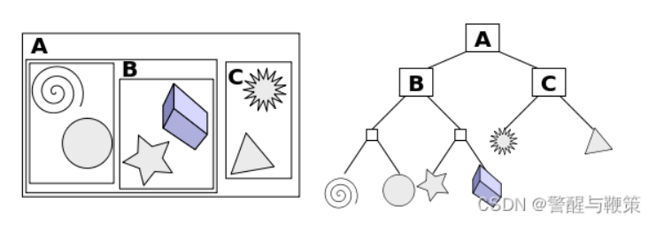
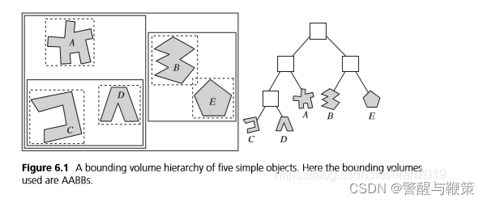
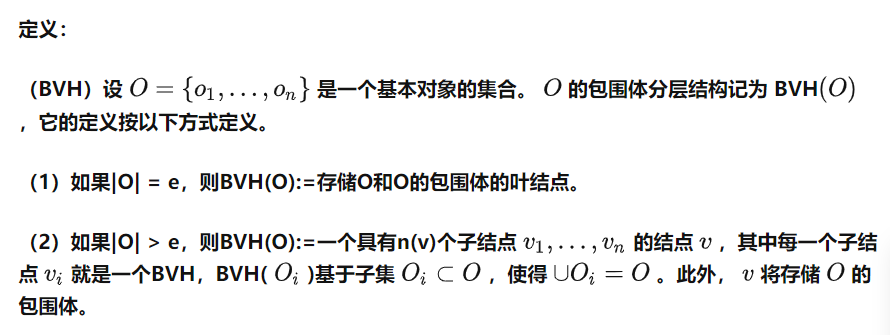
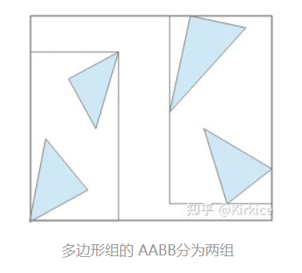
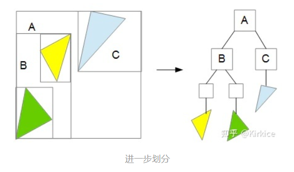
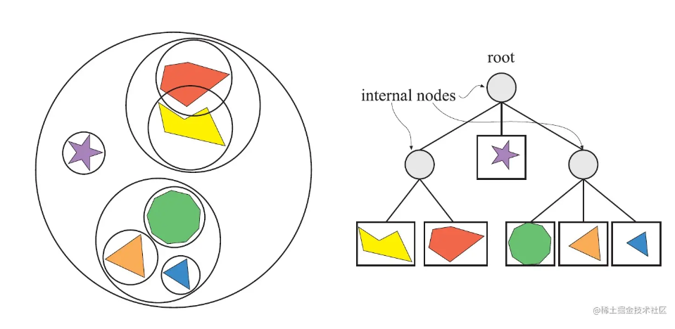

# BVH树

参考文章：  
[https://zhuanlan.zhihu.com/p/430469154](https://zhuanlan.zhihu.com/p/430469154)  
[https://zhuanlan.zhihu.com/p/114307697](https://zhuanlan.zhihu.com/p/114307697)  
[https://juejin.cn/post/7070900273526341669](https://juejin.cn/post/7070900273526341669)
[https://blog.csdn.net/Game_jqd/article/details/122159835](https://blog.csdn.net/Game_jqd/article/details/122159835)

## 定义和介绍

Bounding volume hierarchy (BVH)即**层次包围体**，**是一个二叉树**。在BVH中，所有的几何物体都会被包在 BV 的**叶子节点**里面，BV外面继续包着一个更大的BV，递归地包裹下去，最终形成的根节点会包裹着整个场景。

BVH和空间划分技术不同，它并不是通过切割空间来管理场景中的物件。它是通过将物体分堆，然后在其上面包裹一层BV，达到管理场景的目的。**树的根节点是一个能够包裹全部物体的BV，而树的叶子节点可能只是一个物件的BV**，如下图：

​

​

**图解：**

（注：AABB 包围盒就是轴对称包围盒，即盒子的 6 个面平行于 xy, xz, yz 平面）

光线要击中盒子中的三角形的 **必要条件** 是光线击中盒子，如果光线没有击中盒子，那么必定不会击中盒子里面的所有三角形。

基于这个规律，如果我们将三角形对半分，用两个盒子来分别容纳，就可以简单的用光线和盒子的求交，剔除半数的三角形，从而达到减少求交次数的目的。

​

对于左边和右边的盒子，可以递归地再次进行划分，形成树形结构。

​

## **BVH树的应用**

* 碰撞检测

在Bullet、Havok等物理引擎的碰撞粗测阶段，使用一种叫做 **动态层次AABB包围盒树(Dynamic Bounding Volume Hierarchy Based On AABB Tree)** 的结构来存储动态的AABB形状。  
然后通过该包围盒树的性质（不同父包围盒必定不会碰撞），快速过滤大量不可能发生碰撞的形状对。

* 射线检测/挑选几何体

射线检测从层次包围盒树自顶向下检测是否射线通过包围盒，若不通过则无需检测其子包围盒。  
这种剪裁可让每次射线检测平均只需检测O(logN)数量的形状。  
通过一个点位置快速挑选该点的几何体也是类似的原理。

* 视锥剔除

对BVH树进行中序遍历的视锥测试，如果一个节点所代表的包围盒不在视锥范围内，那么其所有子节点所代表的包围盒都不会在视锥范围内，则可以跳过测试其子节点。在这个遍历过程中，通过测试的节点所代表的几何体才可以发送渲染命令。

* 辅助BSP树构建

在BSP树的构建中，利用球体树辅助，可以将复杂度从O(Nlog²N)下降为O(NlogN)的复杂度。

# 补充

BVH是一种以物体BV为基础进行划分的结构。它由**根节点**（即最顶层的那个节点）、**内部节点**（BV节点）和**叶子节点**组成。**其中叶子节点存放物体，每个非叶子节点都有包围体（BV**），父节点可以把子节点包围起来。

​

每个非叶子节点的包围体大小，是它所包含的所有物体的包围体的总和，所以它在空间上比较紧凑，非常适用于需要大量求相交测试的应用场景，如光线追踪。

BVH树是一种二叉树，**每一个节点记录了它自己的包围盒。对于叶子节点，它存储了它所包含的所有图元；对于非叶子节点，记录了它所包含的孩子节点。**

# 优化

建立完BVH树后，为了节省空间和提高遍历的性能，我们需要将这个二叉树的结构压缩到一个线性数组中。做到：  
1.初始节点是数组中第一个元素  
2.对于非叶子节点，它的第一个孩子就是数组中的下一个元素，同时它会存储第二个孩子的索引  
3.对于叶子节点，它会记录自己包含的图元  
下图是线性化二叉树的示意图：  
​​

